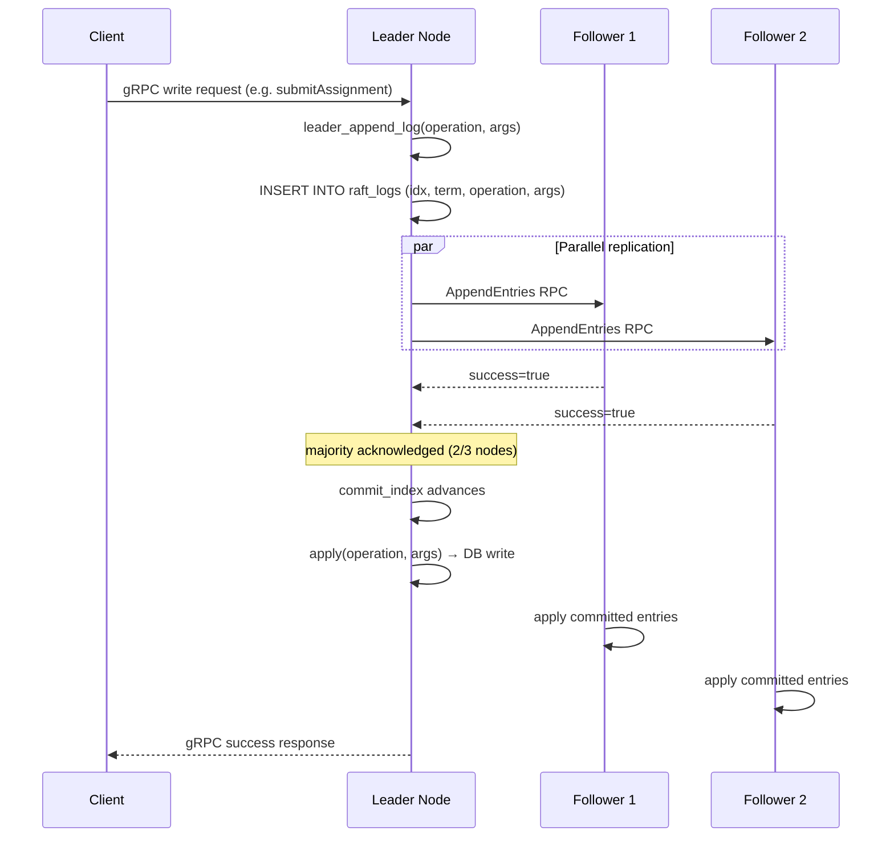
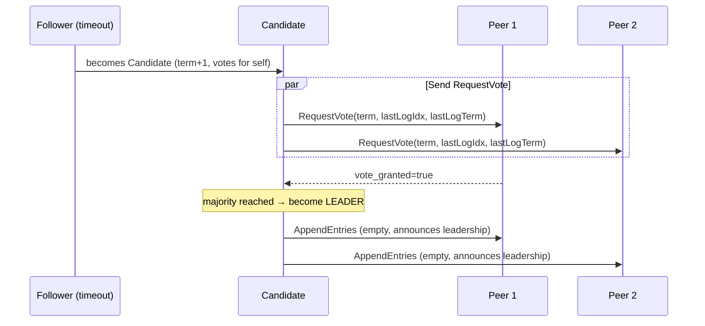
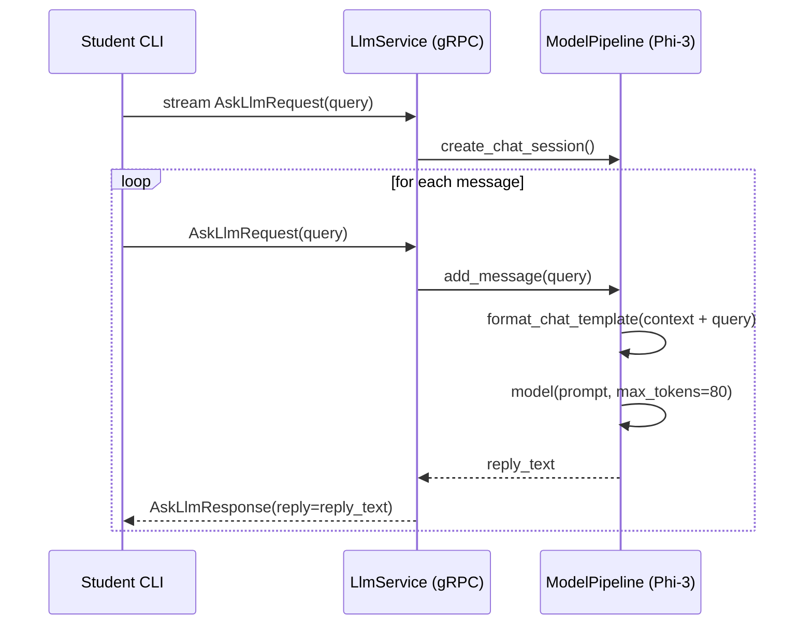
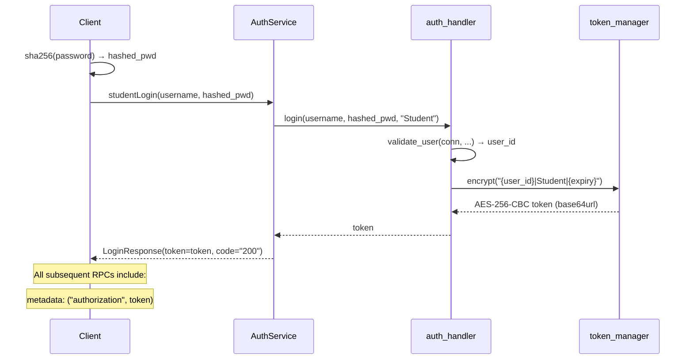

# Architecture — NeuralNexus

## Overview

NeuralNexus is a distributed Learning Management System built on two orthogonal foundations:

1. **Raft consensus** — every write operation is logged, replicated to a majority of nodes, and only then applied. This ensures all nodes converge to the same state even in the presence of failures.
2. **Phi-3 LLM** — a locally-served quantised language model answers student questions in real time via a bidirectional gRPC stream. The model file must be placed at `neuralnexus/server/Model/Phi-3-Context-Obedient-RAG-Q4_K_M.gguf` (inside the server directory, not the repo root). Without it the server still starts normally — only the AI tutoring feature is disabled.

---

## System Components

```
┌────────────────────────────────────────────────────────────────┐
│                       NeuralNexus Client                        │
│                                                                  │
│  client_entry.py ──► leader discovery (getLeader RPC)          │
│        │                                                         │
│        ▼                                                         │
│  connect_to_leader() ──► grpc stubs (Auth/Materials/…/Raft)    │
│        │                                                         │
│        ▼                                                         │
│  ui_actions.py ──► menu_renderer.py (recursive CLI menus)       │
└────────────────────────┬─────────────────────────────────────── ┘
                         │  gRPC (insecure channels, port 5005x)
    ┌────────────────────┼────────────────────────────────┐
    ▼                    ▼                                 ▼
 Node A (leader)      Node B (follower)              Node C (follower)
┌───────────────┐   ┌───────────────┐              ┌───────────────┐
│ services/     │   │ services/     │              │ services/     │
│  auth         │   │  auth         │              │  auth         │
│  materials    │   │  materials    │              │  materials    │
│  assignments  │   │  assignments  │              │  assignments  │
│  queries      │   │  queries      │              │  queries      │
│  llm          │   │  llm          │              │  llm          │
│  raft  ◄──────┼───►  raft  ◄─────┼──────────────►  raft         │
│               │   │               │              │               │
│ consensus/    │   │ consensus/    │              │ consensus/    │
│  raft_node    │   │  raft_node    │              │  raft_node    │
│               │   │               │              │               │
│ database/     │   │ database/     │              │ database/     │
│  lms.db       │   │  lms.db       │              │  lms.db       │
└───────────────┘   └───────────────┘              └───────────────┘
```

---

## Module Layer Map

| Layer | Directory | Responsibility |
|---|---|---|
| Entry Point | `server_entry.py` | Bootstrap DB, register servicers, start Raft timer |
| Services | `services/` | gRPC servicer classes, access-control decorators applied here |
| Handlers | `handlers/` | Business logic, DB writes, filesystem I/O |
| Consensus | `consensus/` | Raft state machine (`Node`) + scheduler (`Timer`) |
| Database | `database/` | SQLite schema, all raw SQL queries |
| Security | `security/` | AES token management, role-based decorators, `.env` settings |
| Proto | `proto/` | `.proto` definition + generated `Lms_pb2` / `Lms_pb2_grpc` |
| Core | `core/` | Shared stdlib imports, utility functions |

---

## Raft Consensus Workflow



**Key properties:**
- Writes only succeed when a majority of nodes (⌊N/2⌋ + 1) acknowledge.
- All writes are idempotent in the log (`ON CONFLICT … DO NOTHING`).
- The leader timer fires every 100 ms; followers time out at a seeded-random 200–400 ms.
- **Single-node mode:** With only Node 1 running, majority resolves to 1 (self-vote is sufficient). Node 1 elects itself leader and all operations succeed — useful for quick local testing but does not demonstrate fault-tolerance. Use all 3 nodes for a proper distributed demo.

---

## Leader Election



---

## LLM Tutoring Workflow

> **Model location:** `neuralnexus/server/Model/Phi-3-Context-Obedient-RAG-Q4_K_M.gguf`
> This path is relative to `neuralnexus/server/` (the server's working directory) — **not** the repo root.
> The model is loaded lazily on first use. If the file is absent the service starts but returns an error on LLM calls.
> See [development-guide.md](development-guide.md#enabling-ai--llm-features) for install instructions.



---

## Authentication Flow



---

## Database Schema

```
roles ←──── users ────┬──── courses ────┬──── materials
                      │                  │
                      ▼                  ├──── assignments ──── assignment_submissions
                course_enrolled          │
                                         └──── queries

node_discovery    raft_logs    state_info
```

| Table | Primary Key | Notes |
|---|---|---|
| `roles` | id (uuid) | Student / Instructor |
| `users` | id (uuid) | FK → roles |
| `courses` | id (uuid) | FK → users (instructor) |
| `course_enrolled` | (course_id, user_id) | Many-to-many |
| `assignments` | id (uuid) | FK → courses |
| `assignment_submissions` | (assignment_id, user_id) | INSERT OR REPLACE |
| `materials` | id (uuid) | FK → courses |
| `queries` | id (uuid) | FK → courses, users |
| `node_discovery` | id (uuid) | Cluster topology |
| `raft_logs` | id (uuid) | UNIQUE (idx, term) |
| `state_info` | — | Single row: term, idx, voted_for |
